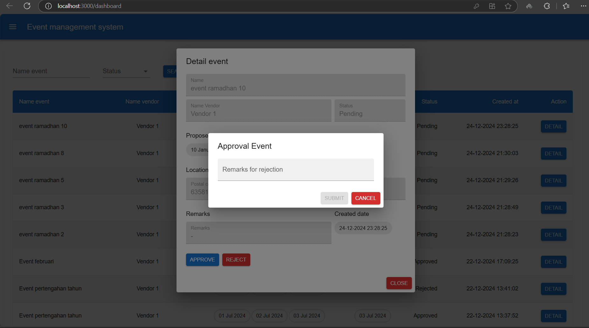

# Event Management System

A web application for managing events, including creating, approving, and managing event data. This app utilizes React, Redux, and Material-UI for the frontend, with an API backend for handling data.

## Key Features

- Displaying a list of events
- Filtering events by status
- Searching for events by name or status
- Managing events with pagination
- Login and authentication using JWT
- Form for creating new events
- Form for approval event

## User Roles

1. **HR User**:
   - Can **create events**.
   - Can **view only the events created by them**.
   - Cannot approve or reject events.
2. **Vendor User**:
   - Can **view events assigned to them**.
   - Can **approve or reject events** assigned to them.

## Technologies

- **Frontend**: React, Redux Toolkit, Material-UI, Day.js
- **Backend**: API Golang, Gin with MySQL for event, authentication, and user data management
- **Authentication**: JSON Web Token (JWT)
- **State Management**: Redux Toolkit
- **Routing**: React Router DOM

## Prerequisites

- Node.js >= v16.x
- npm or yarn

## Installation

1. **Clone this repository**:

   ```bash
   git clone https://github.com/vendor-event-management/event-system-frontend.git
   cd event-management-frontend
   ```

2. **Install dependencies**:

   If using `npm`:

   ```bash
   npm install
   ```

   Or if using `yarn`:

   ```bash
   yarn install
   ```

3. **Run the application**:

   After installation, start the application in development mode:

   ```bash
   npm start
   ```

   Or:

   ```bash
   yarn start
   ```

   The app will run on `http://localhost:3000` by default.

## Usage

### Authentication

- The system uses JWT for login. Users need to log in to access the event pages and manage data.
  
  

### User Role-based Functionality

- **HR User**:

  - After logging in as an HR user, you will be able to:

    - Create new events.
    - View only the events that you created.
    - No options for approving or rejecting events.

    Show events after login
    

    Sidebar

    

    Detail event

    

    Create form

    

- **Vendor User**:

  - After logging in as a Vendor user, you will be able to:

    - View events that are assigned to you.
    - Approve or reject events that are assigned to you.

    Sidebar

    

    Detail event

    

    Approval event form

    

    Rejection event form

    

- **Logout user**:

  - After logout button clicked, it will be redirect to login page:
    
